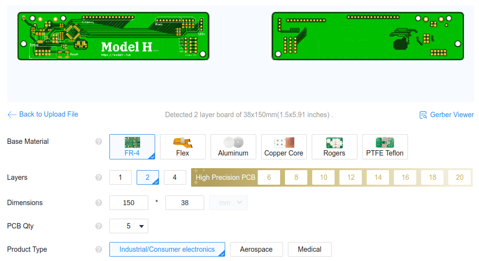
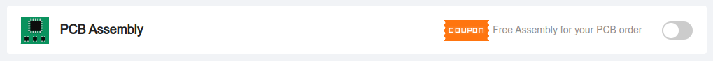
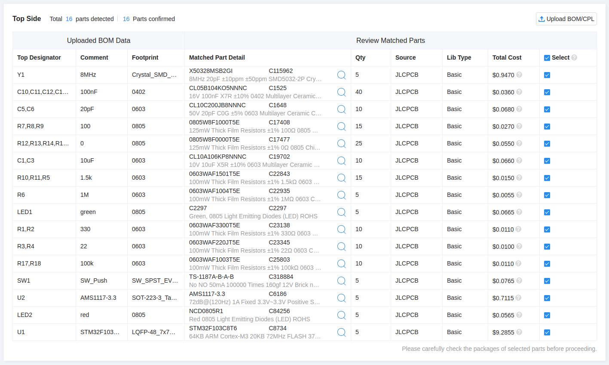
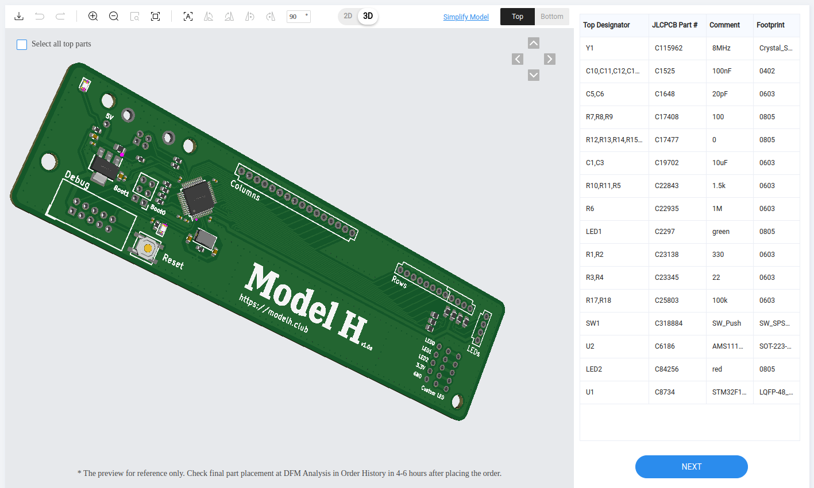

# Model H
## Replacement controller board for IBM Model M Keyboard

The [IBM Enhanced Keyboard (Model
M)](https://en.wikipedia.org/wiki/Model_M_keyboard) is widely
considered the best keyboard for its typing experience. First produced
in 1985, it was made of high quality materials and is very
durable. IBM produced over 10 millions units, and because of their
durability, there are still many working keyboards today.

However, those keyboards were designed for the [PS/2
port](https://en.wikipedia.org/wiki/PS/2_port), which is rarely seen
in recent computers. Some units that were shipped with terminals even
used a RJ-45 interface. As a result, it can be difficult to use this
keyboard with modern computers.

If you want to enjoy the great typing experience of an IBM Model M on a modern computer, you have basically 3 options:

1. You can buy a new unit with a USB interface at [Unicomp](https://www.pckeyboard.com/page/product/NEW_M).
2. You can use an active [PS/2 to USB converter](https://www.clickykeyboards.com/product/ps-2-to-usb-adapter-converter-for-keyboards/). That solution will not work for RJ-45 Model Ms, though.
3. You can replace the original controller with a new one supporting USB. That is what this project proposes.

Out of those 3 options, creating your own controller is clearly the
most involved. That being said, the result is very neat. You'll end up
with a native USB connector that is very well integrated with the
keyboard.

In addition, the controller firmware uses
[QMK](https://github.com/qmk/qmk_firmware), which will allow you to
remap your keys. This is very handy to add media keys and other custom
combinations you may need.

To make your own board, you don't need any knowledge in electronics, however, you'll have to do a bit of soldering.

## Related work

This work is not the first attempt at a replacement controller for the Model M. Here are a few related projects:

- https://www.schwingen.org/modelm-usb/
- https://github.com/ashpil/Model-M-Type-C
- https://github.com/sje-mse/yacobo
- https://store.level1techs.com/products/mstar-classic-model-m-controller-conversion-kit

## Production tutorial

In this tutorial, we will go into all the steps needed to make your Model H controller board.

### PCB
Here, we show how to produce the PCB with
[JLCPCB](jlcpcb.com). There are many similar providers. Feel free to
choose a different one. Note that the bill of material has been
optimized for parts available at JLCPCB. Should you choose a different
provider, you might have to replace some parts.

1. Go to [JLCPCB](jlcpcb.com) and create an account.
2. On the JLCPCB home page, use the button `Add gerber file` to upload the file `gerber.zip` found in the `production` folder of this repo. You should see a page like the image below. Leave the default options.

3. At the bottom of the page, select `PCB Assembly`. Leave the default options, but you may want to change the `PCBA Qty` to 2. Also, select `Yes` for `Confirm Parts Placement`.

4. On the right of the page, click on `NEXT`.
5. You can now visualize both sides of your PCB. Then click on `NEXT` and upload the two files `bom.csv` and `positions.csv` from the `production` folder.
6. Click on `Process BOM & CPL`. At this point, you should see a list of all the components for your design. If all of them are available, click `NEXT`. If a part is out of stock, click on the magnifying glass to select a replacement. Alternatively, you can wait until the part is in stock again. All components of the design were chosen among JLCPCB's __basic parts__ and should normally be available.

7. This page should show you the parts placement (as shown below). Select the 3D view and verify that the components are placed properly. Then click `NEXT`.

8. Select Product Description: Office Appliance.../Keyboard...

9. Save to Cart, Check Out.

#### Cost
At the time of writing (May 2023), the cost of 5 PCBs with 2 assembled was $21 (without shipping).

### Additional Components

While you wait for your PCB to be fabricated, you can order the few
additional components that you'll need to hand solder onto the
board. But first, you need to disassemble your keyboard and check what
kind of wiring you have. Look at this [tutorial](https://blog.nathanv.me/posts/ibm-model-m-cleaning/) for this.

There are several types of connectors for the LEDs.

1. If you don't have LEDs, that's easy. You'll just need a 16-position and a 8-position FFC connectors.
2. If you have an old keyboard with the type of LED cable shown below, you'll have to figure out the type of connector you'll need for it. In addition, you'll need a 16-position and 8-position FFC connectors.

3. If your LEDs are connected with a FFC cable like the one shown below, you'll need a 16-position, 8-position and 4-position FFC connectors.

4. Finally, if you LEDs are integrated to the membrane rows connector (see below), you'll need a 16-position and a 12-position FFC connectors.

* CONN FFC VERT 16POS 2.54MM PCB - https://www.digikey.ca/products/en?keywords=A144434-ND
* CONN FFC VERT 8POS 2.54MM PCB - https://www.digikey.ca/products/en?keywords=5-520315-8-ND
* CONN FFC VERT 4POS 2.54MM PCB - https://www.digikey.ca/products/en?keywords=A123169-ND
